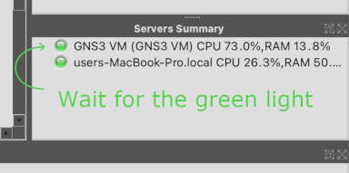

## The Network+ lab environment

# Getting Started
## Configure the virtualization environment for a specific study group (Network+)
These instructions assume you have already installed and configured the software for the Network+ virtual lab environment.  If you haven't or are unsure, run this command:
> ```cd ~/demo && ./setup networkplus```

If you need help, see the ```README.md``` in [demo](https://github.com/dmbrownlee/demo/README.md) for more details.

## Import the network model into GNS3
1. Launch the GNS3 app and wait for the GNS3 VM in VirtualBox to fully boot
  
1. Once the GNS3 VM has booted, in the GNS3 app, go to ```File > Import portable project``` and import the [```~/demo/networkplus/labfiles/labnetwork.gns3project```](labnetwork.gns3project) file
1. Start all the network nodes by clicking the green triangle in the top button bar and wait for all the links to turn green
1. Open the console on the ```control``` host within the provisioning network (you may have to wait several seconds before you get a login prompt) and login as the provisioning user (```ansible```):
  ```
  username: ansible
  password: password
  ```
1. Run</br>
  <code>./setup networkplus.yml</code></br>
  (you will be prompted for the ansible user's password twice, once for SSH and once for become).

## The Network+ virtual lab environment

