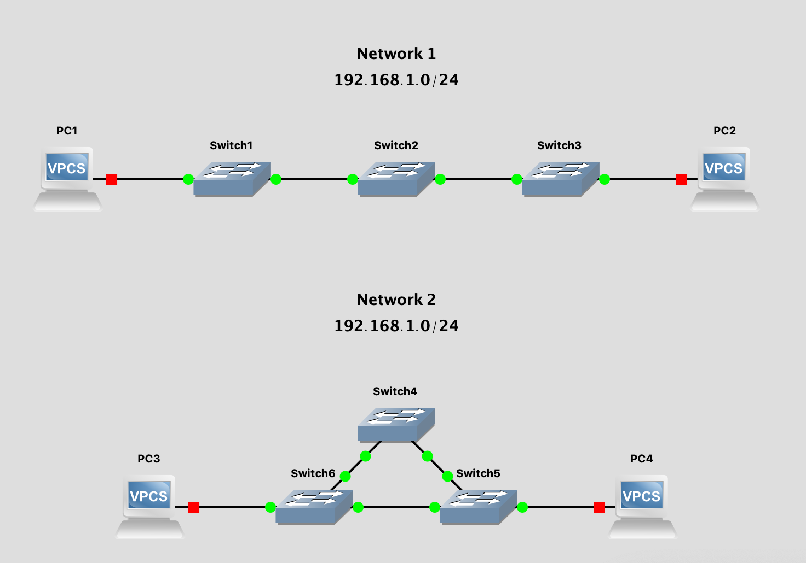

# Networks and Physical Topology

This lab contains two networks, each with three 8-port switches.  Compare how the switches are connected and how that affects how many PCs can be connected to the network and what happens if one of the links between switches goes down.

## Setup
Import the network model into GNS3 using File > Import portable project.  The project file is /Users/<user>/demo/networkplus/labfiles/lab02-1/lab02-1.gns3proj.
You should see the following networks:

## Hands-on Practice
1. Start all the virtual PCs (VPCS = Virtual PC Simulator) by clicking the green, right pointing triangle along the top button bar.  You can also start the VPCS individually by two finger clicking (Mac) or right clicking each and starting the one device from the pop-up menu but this takes longer.
1. Open a console for each VPCS host by clicking the ">_" button (it's supposed to look like a command prompt) in the top button bar or, again, individually from the pop-up menu.
1. From here, you can type '?' to see the available commands.  You don't have to know what the following commands mean for now.  Just enter them as described and they will be explained later.
1. In this example, we will type "ip 192.168.1.1/24" on both PC1 and PC3 and press enter.  Type "ip 192.168.1.2/24" and press enter on PC2 and PC4.  You can type "show ip" on all VPCS hosts to see the changes have been made.
1. On PC1, you can verify connectivity to PC2 with "ping 192.168.1.2".
1. Try two-finger clicking (Mac) or right clicking on a link between any pair of switches and deleting the link.  Then run your ping test again.  Is there any difference between how the two network topologies handle a broken link?

## Food for (future) thought
IP addresses uniquely identify hosts (aka nodes) on a network.  Many home networks use 192.168.1.0/24 as their network address range (aka netblock).  Can PC1 have the same IP address as PC3?  If so, what happens if Network 1 and Network 2 are connected?  How is it that so many home networks can use the same range of addresses when they are connected to the same Internet?

